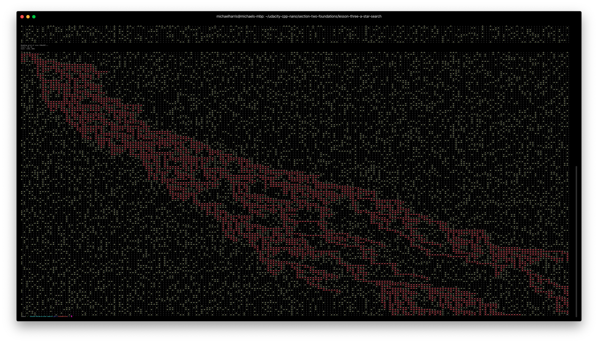

# A* Search Algorithm

The algorithm created in this learning module tries to find the most economical path between the `start` and `goal` coordinates. 

The "*most economical*" path is the one that requires the least distance possible to travel from point `A` to point `B`. 

The algorithm so far tries many routes and does not erase the failed paths (need to fix this but I'm lazy). Checkout the output from an example run (super zoomed out to fit the board on one screen):

- Board params: 150 rows, 207 columns, difficulty of 2 (out of 10)

